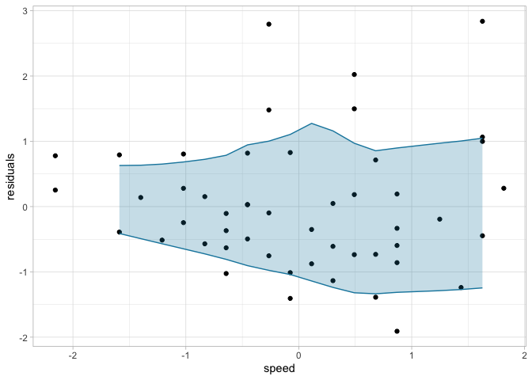

<!-- README.md is generated from README.Rmd. Please edit that file -->

# QLI (Quantile LOWESS Intervals) <a href='https://github.com/martinasladek/qli'></a>

<!-- badges: start -->
<!-- badges: end -->

This is a supplementary package to the paper (currently preprint):

Sladekova, M., & Field, A. P. (2024, June 28). Quantifying
Heteroscedasticity in Linear Models Using Quantile LOWESS Intervals.
<https://doi.org/10.31234/osf.io/gn4mr>

The QLI method can be used for quantifying the amount of
heteroscedasticity in linear models with continuous predictors. The
method constructs an interval around the residuals and then estimates
the change in the width of this interval as a function of either the
predictor values or the fitted values.

Method evaluation, example use, and interpretation are discussed in
[Sladekova & Field (2024)](https://doi.org/10.31234/osf.io/gn4mr).

## Installation

The package is currently on available on CRAN. You can install the
development version of qli from [GitHub](https://github.com/) with:

``` r
# install.packages("devtools")
devtools::install_github("martinasladek/qli")
```

## Examples

The `qli()` function works with linear models fitted with `lm()`. The
function takes the model and extracts the residuals and either the
predictor values or the fitted values as specified by the user.

``` r
library(qli)

cars_mod <- lm(dist ~ speed, data = cars)
qli(mod = cars_mod)
#> 
#> Call:
#> stats::lm(formula = lowess_wide ~ x + I(x^2) + I(x^3) + I(x^4), 
#>     data = qli_df)
#> 
#> Coefficients:
#> (Intercept)            x       I(x^2)       I(x^3)       I(x^4)  
#>     2.34961      0.60082     -0.70221      0.01991      0.23298
```

The function returns the estimates for linear change x, quadratic change
I(x^2), cubic change I(x^3), and quartic change I(x^4).

By default, the function uses fitted values as the predictor. We can
also look at the relation between the residuals and the specific
predictors in the model:

``` r
qli(mod = cars_mod, predictor = "speed")
#> 
#> Call:
#> stats::lm(formula = lowess_wide ~ x + I(x^2) + I(x^3) + I(x^4), 
#>     data = qli_df)
#> 
#> Coefficients:
#> (Intercept)            x       I(x^2)       I(x^3)       I(x^4)  
#>     2.19385      0.51056     -0.59048     -0.05258      0.15408
```

We can also request a visual representation of the interval:

``` r
qli(mod = cars_mod, predictor = "speed", plot = TRUE)
```



Additional optional arguments are specified in the help documentation
`?qli` .
